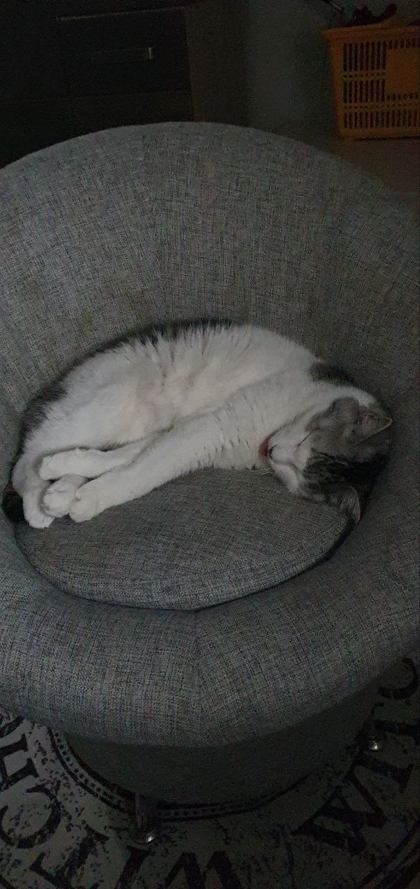

Привет, меня зовут Алексей.

Здесь будет много текста обо мне, когда я его придумаю, но пока я не придумал, поэтому просто показываю, что может markdown.

Он может вот так:

1. Списочек делает.
2. А это второй пункт списочка.

Еще может вот так:

- Тоже списочек, но уже другой.
- Еще один элемент списочка.

А еще может делать заголовки. Почему бы не прописать заголовок прямо посередине текст?

# Заголовок

Еще он может выделять цвет **жирным**.

Но и это не все.

Вот так можно сделать картиночку прямо в файле:

